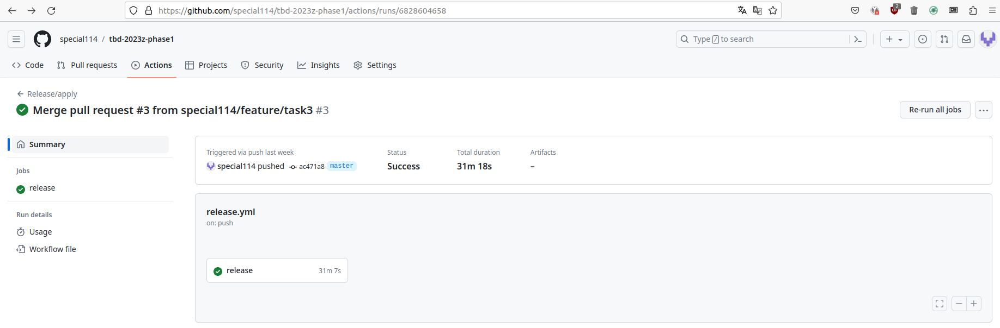
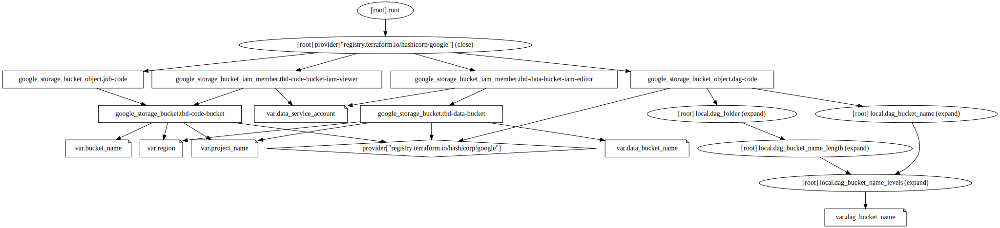

IMPORTANT ❗ ❗ ❗ Please remember to destroy all the resources after each work session. You can recreate infrastructure by creating new PR and merging it to master.
  


1. Authors:

   ***Grupr no. 6***

   ***repo: https://github.com/special114/tbd-2023z-phase1***
   
2. Fork https://github.com/bdg-tbd/tbd-2023z-phase1 and follow all steps in README.md.

3. Select your project and set budget alerts on 5%, 25%, 50%, 80% of 50$ (in cloud console -> billing -> budget & alerts -> create buget; unclick discounts and promotions&others while creating budget).

  

4. From avaialble Github Actions select and run destroy on main branch.

5. Create new git branch and add two resources in ```/modules/data-pipeline/main.tf```:
    1. resource "google_storage_bucket" "tbd-data-bucket" -> the bucket to store data. Set the following properties:
        * project  // look for variable in variables.tf
        * name  // look for variable in variables.tf
        * location // look for variable in variables.tf
        * uniform_bucket_level_access = false #tfsec:ignore:google-storage-enable-ubla
        * force_destroy               = true
        * public_access_prevention    = "enforced"
        * if checkcov returns error, add other properties if needed
       
    2. resource "google_storage_bucket_iam_member" "tbd-data-bucket-iam-editor" -> assign role storage.objectUser to data service account. Set the following properties:
        * bucket // refere to bucket name from tbd-data-bucket
        * role   // follow the instruction above
        * member = "serviceAccount:${var.data_service_account}"

    ***Link to modified file: https://github.com/special114/tbd-2023z-phase1/blob/master/modules/data-pipeline/main.tf***
   
    ***Code snippet:***
   ```
   resource "google_storage_bucket" "tbd-data-bucket" {
     project                     = var.project_name
     name                        = var.data_bucket_name
     location                    = var.region
     uniform_bucket_level_access = false #tfsec:ignore:google-storage-enable-ubla
     force_destroy               = true
     public_access_prevention    = "enforced"

     #checkov:skip=CKV_GCP_78: "Ensure Cloud storage has versioning enabled"
   }
   
   resource "google_storage_bucket_iam_member" "tbd-data-bucket-iam-editor" {
     bucket = google_storage_bucket.tbd-data-bucket.name
     role   = "roles/storage.objectUser"
     member = "serviceAccount:${var.data_service_account}"
   }
   ```

    Create PR from this branch to **YOUR** master and merge it to make new release. 
    
    
    

7. Analyze terraform code. Play with terraform plan, terraform graph to investigate different modules.

    ***describe one selected module and put the output of terraform graph for this module here***
   ***Opisywany moduł: data-pipeline***

   Ten kod Terraform definiuje zasoby na GCP w celu utworzenia Cloud Storage Buckets oraz nadania odpowiednich uprawnień za pomocą ról IAM. Poniżej przedstawiamy opisy poszczególnych zasobów:
   ```
   locals {
    dag_bucket_name_levels = split("/", var.dag_bucket_name)
    dag_bucket_name_length = length(local.dag_bucket_name_levels)
    dag_folder             = element(local.dag_bucket_name_levels, local.dag_bucket_name_length - 1)
    dag_bucket_name        = element(local.dag_bucket_name_levels, 2)
   }
   ```
   Definicja lokalnych zmiennych, które będą używane przy tworzeniu bucketu przechowującego kod związany ze zadaniami z zależnościami skierowanymi (DAG) (plik modules/data-pipeline/resources/data-dag.py).

   ```
   resource "google_storage_bucket" "tbd-code-bucket" {
      project                     = var.project_name
      name                        = var.bucket_name
      location                    = var.region
      uniform_bucket_level_access = false #tfsec:ignore:google-storage-enable-ubla
      force_destroy               = true
      versioning {
        enabled = true
      }
    
      #checkov:skip=CKV_GCP_62: "Bucket should log access"
      #checkov:skip=CKV_GCP_29: "Ensure that Cloud Storage buckets have uniform bucket-level access enabled"
      #checkov:skip=CKV_GCP_78: "Ensure Cloud storage has versioning enabled"
      public_access_prevention = "enforced"
   }
   ```
   Utworzenie bucketa przechowującego dodatkowy kod skryptów wykonywanych jobów (modules/data-pipeline/resources/spark-job.py). Nazwa projektu, nazwa bucketa i jego lokalizacja ustalane są na
   poziomie globalnym. Pozostałe właściwości blokują publiczny dostęp do bucketa, umożliwają wersjonowanie oraz pozwalają niszczenie kubełka nawet jeżeli nie jest pusty (nie przechowujemy
   tu wrażliwych danych). `uniform_bucket_level_access = false` oznacza, że możemy oddzielnie zarządzać uprawnieniami dostępu dla poszczególnych obiektów.

   ```
   resource "google_storage_bucket_iam_member" "tbd-code-bucket-iam-viewer" {
      bucket = google_storage_bucket.tbd-code-bucket.name
      role   = "roles/storage.objectViewer"
      member = "serviceAccount:${var.data_service_account}"
   }
   ```
   Nadanie możliwości przeglądania bucketa dla utworzonego konta serwisowego.

   ```
   resource "google_storage_bucket_object" "job-code" {
      for_each = toset(["spark-job.py"])
      bucket   = google_storage_bucket.tbd-code-bucket.name
      name     = each.value
      source   = "${path.module}/resources/${each.value}"
   }
   ```
   Utworzenie obiektu z plikiem `modules/data-pipeline/resources/spark-job.py` we wcześniej zdefiniowanym buckecie.

   ```
   resource "google_storage_bucket_object" "dag-code" {
      for_each = toset(["data-dag.py"])
      bucket   = local.dag_bucket_name
      name     = "${local.dag_folder}/${each.value}"
      source   = "${path.module}/resources/${each.value}"
   }
   ```
   Utworzenie obiektu z plikiem `modules/data-pipeline/resources/data-dag.py` w buckecie stworzonym przez moduł Composer.

   ```
    resource "google_storage_bucket" "tbd-data-bucket" {
      project                     = var.project_name
      name                        = var.data_bucket_name
      location                    = var.region
      uniform_bucket_level_access = false #tfsec:ignore:google-storage-enable-ubla
      force_destroy               = true
      public_access_prevention    = "enforced"
  
      #checkov:skip=CKV_GCP_78: "Ensure Cloud storage has versioning enabled"
    }
   ```
   Utworzenie bucketu na przechowywanie i przetwarzanie danych przez Apache Airflow.

   ```
   resource "google_storage_bucket_iam_member" "tbd-data-bucket-iam-editor" {
        bucket = google_storage_bucket.tbd-data-bucket.name
        role   = "roles/storage.objectUser"
        member = "serviceAccount:${var.data_service_account}"
   }
   ```
   Nadanie możliwości czytania i zapisywania do powyższego bucketa dla utworzonego konta serwisowego.
   
   
   Przy pomocy komendy uruchomionej w katalogu `tbd-2023z-phase1/modules/data-pipeline`
   `terraform graph | dot -Tsvg > graph.svg`
   wygenerowaliśmy graf zależności.

   
   
9. Reach YARN UI

   Połączenie z YARN UI uzyskano poprzez wykonanie komendy połączenia z serwerem `tbd-cluster-m`:
   
   `gcloud compute ssh --zone "europe-west1-b" "tbd-cluster-m" --project "tbd-2023z-300271-2" -- -L 8088:localhost:8088`
   
   i połączeniu się z portem ***8088***.
   
   
   


11. Draw an architecture diagram (e.g. in draw.io) that includes:
    1. VPC topology with service assignment to subnets
    2. Description of the components of service accounts
    3. List of buckets for disposal
    4. Description of network communication (ports, why it is necessary to specify the host for the driver) of Apache Spark running from Vertex AI Workbech
  
    ***place your diagram here***

12. Add costs by entering the expected consumption into Infracost

   ***place the expected consumption you entered here***

   ***place the screenshot from infracost output here***

11. Some resources are not supported by infracost yet. Estimate manually total costs of infrastructure based on pricing costs for region used in the project. Include costs of cloud composer, dataproc and AI vertex workbanch and them to infracost estimation.

    ***place your estimation and references here***

    ***what are the options for cost optimization?***
    
12. Create a BigQuery dataset and an external table
    
    ***place the code and output here***
   
    ***why does ORC not require a table schema?***
  
13. Start an interactive session from Vertex AI workbench (steps 7-9 in README):

    ***place the screenshot of notebook here***
   
14. Find and correct the error in spark-job.py

    ***describe the cause and how to find the error***

15. Additional tasks using Terraform:

    1. Add support for arbitrary machine types and worker nodes for a Dataproc cluster and JupyterLab instance

    ***place the link to the modified file and inserted terraform code***
    
    3. Add support for preemptible/spot instances in a Dataproc cluster

    ***place the link to the modified file and inserted terraform code***
    
    3. Perform additional hardening of Jupyterlab environment, i.e. disable sudo access and enable secure boot
    
    ***place the link to the modified file and inserted terraform code***

    4. (Optional) Get access to Apache Spark WebUI

    ***place the link to the modified file and inserted terraform code***
